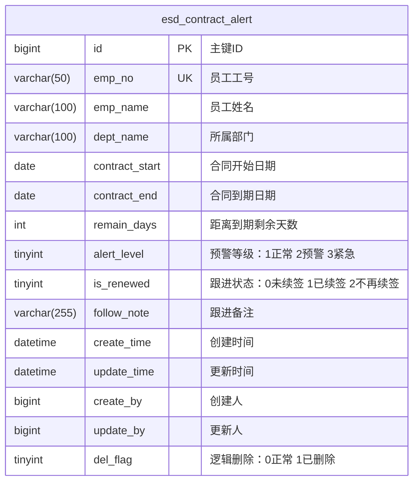

# 员工合同预警模块 ER实体关系图

```mermaid
erDiagram
    esd_contract_alert {
        bigint id PK "主键ID"
        varchar(50) emp_no UK "员工工号"
        varchar(100) emp_name "员工姓名"
        varchar(100) dept_name "所属部门"
        date contract_start "合同开始日期"
        date contract_end "合同到期日期"
        int remain_days "距离到期剩余天数"
        tinyint alert_level "预警等级：1正常 2预警 3紧急"
        tinyint is_renewed "跟进状态：0未续签 1已续签 2不再续签"
        varchar(255) follow_note "跟进备注"
        datetime create_time "创建时间"
        datetime update_time "更新时间"
        bigint create_by "创建人"
        bigint update_by "更新人"
        tinyint del_flag "逻辑删除：0正常 1已删除"
    }
```
